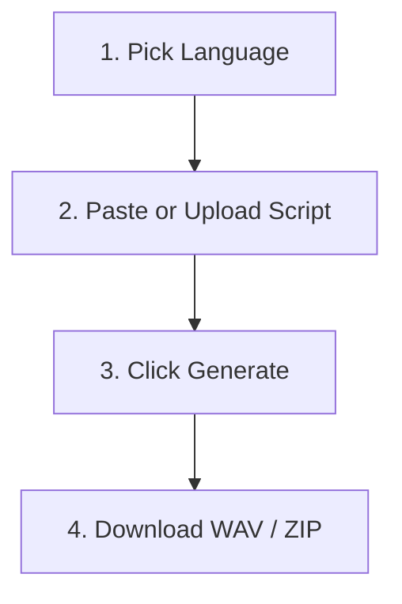

# For Your Associate — How to Generate Consultation Audio

This sheet describes how to access and use the Indian OPD Audio Generator.

---

## 1. Access the Application

Open the following link in any web browser on your laptop or phone:
*   **Link**: `https://startup-speak-msie-knee.trycloudflare.com`

---

## 2. Generate Audio in Three Simple Steps

Follow these instructions to generate your OPD audio:



### Step 1: Select Language
*   Use the **Language** dropdown at the top to select the target language.
*   Choices are:
    *   **Gujarati**
    *   **Telugu**
    *   **Hindi + English** (Default)
    *   **Marathi + English**
    *   **Gujarati + English**
    *   **Telugu + English**
*   *Note: Regional + English options produce natural code-switched speech containing clinical English terminology (e.g. fever, headache, scanner) integrated into local grammar.*

### Step 2: Paste or Upload Script
*   Type or paste the consultation script into the **Consultation Script Text** editor.
*   Format the script by using `Speaker: Speech Text` turns, like this:
    ```
    Doctor: Hello, Arjun! Kaise ho beta?
    Patient: Doctor sahab, kal raat se fever aur cold thayo che.
    ```
*   Alternatively, click **Upload file** to drag-and-drop a `.txt`, `.md`, `.pdf`, or `.docx` script file.

### Step 3: Click Generate & Download
*   Once a script is entered, the **Session Summary** card will appear in the right column showing parsed turns.
*   Click the green **GENERATE CONSULTATION AUDIO** button.
*   The progress bar will show the completed turns.
*   Once complete, download individual speech clips or click **Download ZIP** to retrieve the entire conversation and transcript.

---

*Note: All speaker demographics (gender, age), pacing, tones, and clinic background noise are randomized automatically on each click of the Generate button.*
